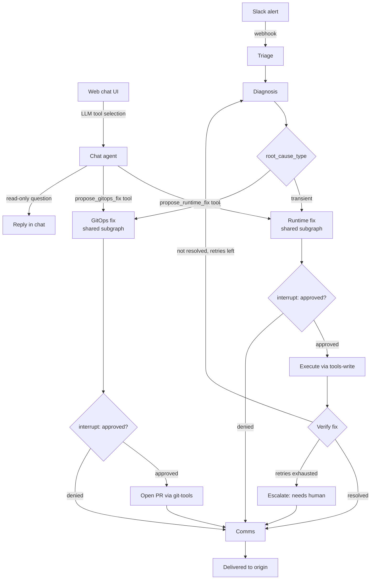

# CLAUDE.md

Context for working on this codebase — a multi-agent Kubernetes ops platform
combining kagent-style chat operations with AtlasOps-style automated incident
response, built with LangGraph. For the human-facing overview, see README.md.
This file is for correctness while writing code, not for persuasion.

## Project summary

One LangGraph service, one FastAPI app, two entry points (`/alert`, `/chat`)
that both feed the same graph, sharing the same tools, the same approval
mechanism, and — for write actions — the same execution subgraphs.

## Architecture (canonical — keep in sync with docs/architecture.md)



## Core design principles (constraints, not narrative)

- **Human-in-the-loop on every write.** `interrupt()` must gate every call
  into `tools-write` or `git-tools`, with no code path that reaches either
  without passing through an approval node first. When adding a new tool or
  node that writes anything, wire the approval gate before wiring the tool
  call — do not add the call first and gate it later.
- **GitOps-aware remediation is a hard split, not a heuristic to loosen.**
  `root_cause_type == "config_drift"` must always route to `gitops_fix`,
  never to a direct cluster patch. Do not add a "quick patch" path for
  config-caused issues even if it seems faster — it will be reverted by Argo
  CD reconciliation and silently reintroduce the bug.
- **RBAC boundaries are enforced by ServiceAccount, not by prompt.** Runtime
  fix calls the `tools-write` MCP server (`agent-write-sa`). GitOps fix calls
  only `git-tools` (no k8s RBAC at all). Diagnosis, Triage, and the chat
  agent's read-only tool calls use `tools-read` (`agent-read-sa`). Never
  point a node at a tool server outside its assigned role.
- **Linear/deterministic path vs. agentic path — do not blur this boundary.**
    - `nodes/` (Triage, Diagnosis, Verify, Comms, Escalate) are called only
      from the fixed alert-path sequence. Transitions between them are plain
      Python functions reading state fields (`root_cause_type`, `verified`,
      `retry_count`). No LLM call decides routing here.
    - `subgraphs/` (Runtime fix, GitOps fix) are shared — both the alert path
      and the chat agent's tool calls (`propose_runtime_fix`,
      `propose_gitops_fix`) enter the same subgraph. Do not duplicate this
      logic inside `chat_agent/tools.py` — the chat agent must call the shared
      subgraph, never reimplement scaling/patching itself.
    - `chat_agent/` is the only place an LLM decides "which tool next." Keep
      that discretion scoped to _which tool to call_, never to _how a
      privileged action executes_ — execution always drops into the
      deterministic subgraphs above.
- **Verify before declaring success.** After `execRuntime`, re-check the
  original triggering signal before routing to Comms. Do not route directly
  from `execRuntime` to `comms` without passing through `verify`.
- **Bounded retries, explicit escalation.** `retry_count` must be checked
  before looping `verify` back to `diagnosis`. On exhausting retries, route
  to `escalate`, not silently to `comms` — the operator needs to know
  automated remediation failed, not just that a run finished.
- **Alerts trigger runs; logs are queried on demand.** Diagnosis calls Loki
  (LogQL) directly when it needs log context. No node should subscribe to or
  continuously ingest a log stream — that is explicitly out of scope.

## State schema (`IncidentState`)

```python
class IncidentState(TypedDict):
    trigger: Literal["alert", "chat"]
    raw_input: dict
    severity: str | None
    service: str | None
    diagnosis: str | None
    root_cause_type: Literal["transient", "config_drift"] | None
    proposed_action: dict | None
    approval: Literal["pending", "approved", "denied"] | None
    pr_url: str | None
    retry_count: int
    verified: bool | None
    result: str | None
```

Add fields here before using them in a node — do not smuggle new keys into
state from inside a node function without updating this schema and this file.

## Kubernetes objects (agent-platform namespace)

| Object                               | Purpose                                                             |
| ------------------------------------ | ------------------------------------------------------------------- |
| `agent-service` Deployment + Service | Runs the whole LangGraph app, port 8000                             |
| `tools-read` Deployment + Service    | MCP server, read-only k8s tools, `agent-read-sa`                    |
| `tools-write` Deployment + Service   | MCP server, write k8s tools, `agent-write-sa`                       |
| `git-tools` Deployment + Service     | MCP server, git/GitHub tools, no k8s RBAC                           |
| `postgres` StatefulSet + PVC         | LangGraph checkpointer                                              |
| `Ingress`                            | Routes `/chat` and `/alert` to `agent-service`                      |
| Secrets                              | `llm-api-key`, `github-token` (git-tools only), `slack-webhook-url` |
| `NetworkPolicy` (stretch)            | Only `agent-service` may reach the tool servers                     |

## MCP tool servers (in-cluster DNS)

```
http://tools-read.agent-platform.svc.cluster.local:8000/mcp
http://tools-write.agent-platform.svc.cluster.local:8000/mcp
http://git-tools.agent-platform.svc.cluster.local:8000/mcp
```

## Repo layout

```
agent_service/
├── main.py                    # FastAPI app, /chat and /alert routes
├── graph/
│   ├── state.py               # IncidentState
│   ├── build_graph.py         # StateGraph wiring, conditional edges
│   └── nodes/                 # triage.py, diagnosis.py, etc
├── chat_agent/                # agent.py (ReAct loop), tools.py, prompts.py
py
├── mcp_clients/                # tools_read_client.py, tools_write_client.py, git_tools_client.
```

## Guardrails to preserve when adding tools or nodes

- Fixed, typed tool functions (`scale_deployment(name, namespace, replicas)`),
  never a generic `execute_kubectl(cmd: str)`-style tool.
- Namespace/name allowlist checks inside the tool implementation itself, not
  only in a prompt.
- Every tool call emits a structured log/OTel span: identity used, arguments,
  approval state at call time, result.
- Any new write-capable tool must be added to `tools-write` or `git-tools`
  only — never to `tools-read`.
