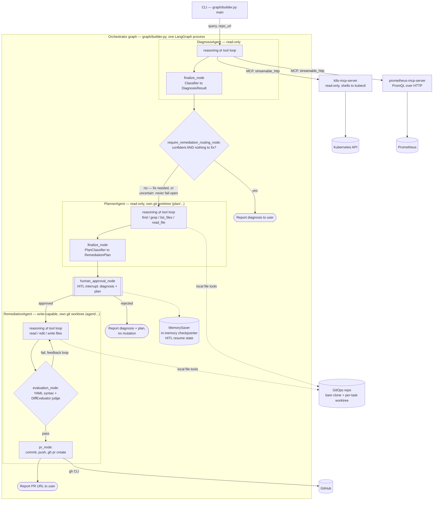

# Kubernaut

An autonomous (human-gated) SRE agent for Kubernetes that answers questions, diagnoses incidents from chat or Prometheus alerts, plans remediations, and ships GitOps fixes as GitHub PRs.

---

## 1. Functionality

- Chat-based Q&A over live cluster state ("what namespace is pod X in?", "why is the backend-deployment keeps on failing on dev namespace?").
- Diagnose using cluster state (pods, events, describe), and prometheus metrics
- Produce a remediation plan and, when the fix is a config/manifest change, open - a GitHub PR.

## 2. Architecture Diagram

---

## 3. Workflow

1. The user submits a query via the CLI (`graph/builder.py`'s `main()`) — a question or an
   incident description — along with the GitOps repo URL to use if remediation turns out to be
   needed.
2. **`DiagnosisAgent`** investigates read-only, in a reasoning ⇄ tool loop against
   `k8s-mcp-server` and `prometheus-mcp-server`, then hands its findings to a classifier LLM
   call that produces a structured `DiagnosisResult` (summary, root cause, whether remediation
   is required, and whether the diagnosis itself was confident/complete).
3. The orchestrator routes on that result: if the diagnosis is confident **and** nothing needs
   fixing, it reports the diagnosis to the user and stops. Otherwise — a real issue was found,
   or the diagnosis was inconclusive — it proceeds to planning. An uncertain diagnosis is never
   treated as "nothing to do."
4. **`PlannerAgent`** clones the GitOps repo into its own isolated, read-only git worktree
   (`plan/...` branch) and investigates which file(s) need to change, then hands its findings to
   its own classifier call, producing a structured `RemediationPlan` — an ordered, file-by-file
   list of concrete steps.
5. The graph pauses at a **human-in-the-loop interrupt**, showing both the diagnosis and the
   proposed plan for review — no mutation happens without explicit approval.
6. If the human rejects, the graph ends with nothing changed. If approved, **`RemediationAgent`**
   takes over in its own separate, write-capable git worktree (`agent/...` branch).
7. For each plan step, `RemediationAgent` reads the target file directly (falling back to a
   broader `find`/`grep` investigation only if a step's file isn't where expected) and applies
   the change.
8. Before opening a PR, it validates its own diff — YAML syntax check, then an LLM judge that
   checks the change actually and narrowly addresses the task — looping back to fix issues until
   the diff passes, or until it exhausts its iteration budget.
9. Once the diff passes, it commits, pushes its branch, and opens a GitHub PR via the `gh` CLI,
   then reports the PR URL back to the user.

---

## 4. Tech Stack Summary

| Layer         | Choice                                                                         |
| ------------- | ------------------------------------------------------------------------------ |
| Orchestration | **LangGraph** (supervisor + subgraphs, Postgres checkpointer, HITL interrupts) |
| Serving       | FastAPI                                                                        |
| Tools         | **MCP servers**: Kubernetes, Prometheus (`langchain-mcp-adapters`)             |
| State/Memory  | Postgres (checkpointer + audit)                                                |
| Observability | LangSmith + OpenTelemetry                                                      |
| Delivery      | GitHub PRs → Argo CD (GitOps)                                                  |
| Packaging     | Helm umbrella chart                                                            |
