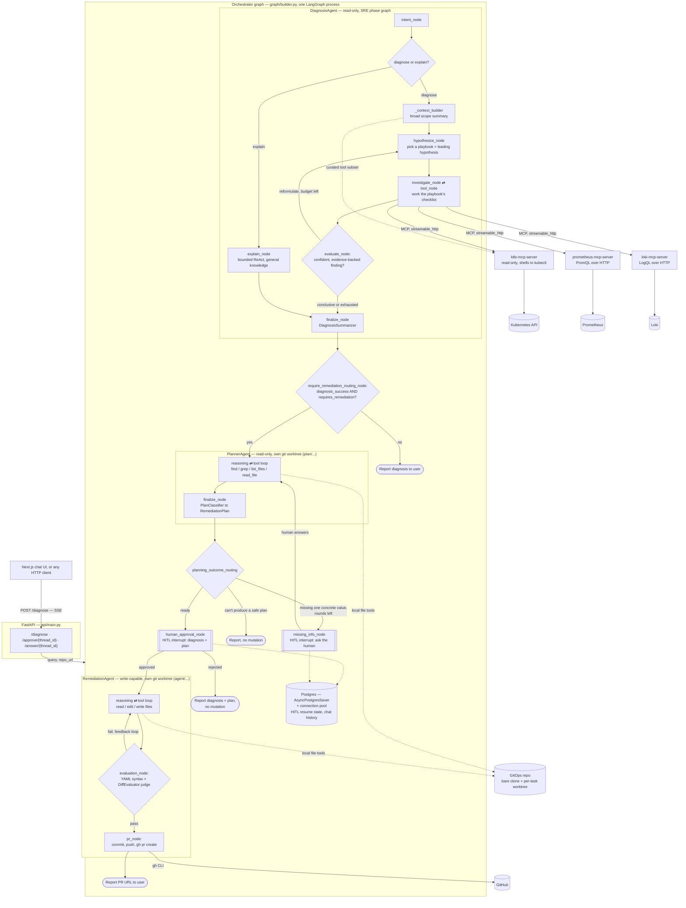

# Kubernaut

An autonomous (human-gated) SRE agent for Kubernetes that answers questions, diagnoses incidents from chat or Prometheus alerts, plans remediations, and ships GitOps fixes as GitHub PRs.

---

## 1. Functionality

- Chat-based Q&A over live cluster state ("what namespace is pod X in?", "why is the backend-deployment keeps on failing on dev namespace?").
- Diagnose using cluster state (pods, events, describe), Prometheus metrics, and Loki logs — following a playbook per failure category (scheduling, storage, networking, RBAC, resource governance, rollout, autoscaling, generic Pod Lifecycle).
- Produce a remediation plan and, when the fix is a config/manifest change, open a GitHub PR. If the plan needs one concrete value it can't determine itself (e.g. a valid image tag), it asks the human that specific question instead of guessing or proposing an unexecutable plan.

## 2. Architecture Diagram

---

## 3. Workflow

1. The user submits a query via the Next.js chat UI (or any HTTP client) — a question or an
   incident description — to FastAPI's `POST /diagnose`, which streams progress back over SSE
   and persists chat history to Postgres.
2. **`DiagnosisAgent`** first classifies intent: a general knowledge question routes to
   `explain_node` (a bounded ReAct loop answering directly, without claiming to have checked a
   live cluster); an actual incident routes into the SRE phase graph — `_context_builder` builds
   a broad, non-diagnosing scope summary, `hypothesize_node` picks the best-matching playbook
   (scheduling, storage, networking, RBAC, resource governance, rollout, autoscaling, or a
   generic Pod Lifecycle fallback) and a leading hypothesis, and `investigate_node` works that
   playbook's checklist against `k8s-mcp-server`, `prometheus-mcp-server`, and `loki-mcp-server`.
   `evaluate_node` judges the result on its own evidentiary merits — a well-evidenced pivot to a
   different mechanism than the one being investigated still counts as conclusive — looping back
   to try a new hypothesis (bounded) if the finding isn't confident yet. Either path ends at
   `finalize_node`, which produces a structured `DiagnosisResult` (summary, root cause, and
   whether the investigation itself was confident/complete).
3. The orchestrator routes on `diagnosis_success` and `requires_remediation`: an inconclusive
   diagnosis, or an "explain" intent (`requires_remediation` is set deterministically to `False`
   for explain-mode results, never left to the LLM), reports back to the user and stops. Any
   other confident diagnosis proceeds to planning — whether the finding is actually fixable via a
   manifest change from there is `PlannerAgent`'s call, not a further pre-gate here.
4. **`PlannerAgent`** clones the GitOps repo into its own isolated, read-only git worktree
   (`plan/...` branch) and investigates which file(s) need to change, then hands its findings to
   `PlanClassifier`, producing a structured `RemediationPlan` — an ordered, file-by-file list of
   concrete steps, or an explanation of what's missing.
5. If the plan is otherwise complete except for one concrete value `PlannerAgent` has no way to
   determine (e.g. a valid replacement image tag), the graph pauses at a **missing-information
   interrupt** asking that specific question, then re-invokes `PlannerAgent` with the human's
   answer folded in — bounded to a couple of rounds so it can't loop forever. If planning fails
   outright with nothing to ask, the graph reports back and stops rather than presenting an
   unexecutable plan.
6. Once a real plan exists, the graph pauses at a **human-in-the-loop approval interrupt**,
   showing both the diagnosis and the proposed plan for review — no mutation happens without
   explicit approval.
7. If the human rejects, the graph ends with nothing changed. If approved, **`RemediationAgent`**
   takes over in its own separate, write-capable git worktree (`agent/...` branch).
8. For each plan step, `RemediationAgent` reads the target file directly (falling back to a
   broader `find`/`grep` investigation only if a step's file isn't where expected) and applies
   the change.
9. Before opening a PR, it validates its own diff — YAML syntax check, then an LLM judge that
   checks the change actually and narrowly addresses the task — looping back to fix issues until
   the diff passes, or until it exhausts its iteration budget.
10. Once the diff passes, it commits, pushes its branch, and opens a GitHub PR via the `gh` CLI,
    then reports the PR URL back to the user.

---

## 4. Tech Stack Summary

| Layer         | Choice                                                                         |
| ------------- | ------------------------------------------------------------------------------ |
| Orchestration | **LangGraph** (supervisor + subgraphs, Postgres checkpointer, HITL interrupts) |
| Serving       | FastAPI (SSE streaming) + Next.js chat UI                                     |
| Tools         | **MCP servers**: Kubernetes, Prometheus, Loki (`langchain-mcp-adapters`)      |
| State/Memory  | Postgres (`AsyncPostgresSaver` + connection pool — checkpointer + chat/audit) |
| Observability | LangSmith + OpenTelemetry                                                      |
| Delivery      | GitHub PRs → Argo CD (GitOps)                                                  |
| Packaging     | Helm umbrella chart                                                            |
