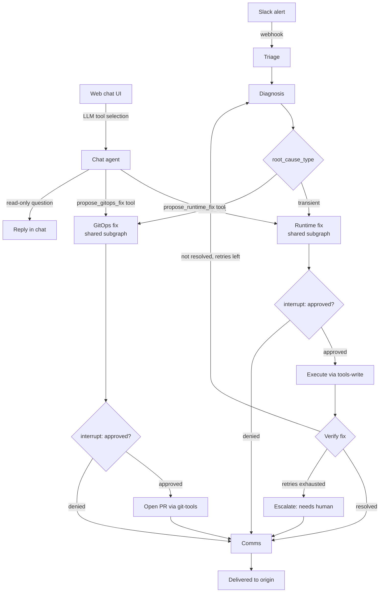

# Kubernaut

_An AI agent that triages Kubernetes incidents, diagnoses root cause, and
fixes them — escalating to a pull request instead of a live patch when the
fix actually belongs in git._

> Working title — swap freely if you land on something better.

## Demo

_[Video/GIF here: an alert fires, the agent triages and diagnoses it, posts
a proposed fix to Slack, a human approves, the fix is applied (or a PR is
opened), and the agent confirms resolution.]_

## Why this exists

Two open-source projects inspired this: **kagent** gives you chat-driven,
natural-language Kubernetes operations. **AtlasOps**-style pipelines give you
autonomous, alert-driven incident response. Most tools do one or the other.
This project combines both into one system: a single LangGraph service that
answers operator questions in chat _and_ reacts to Prometheus alerts on its
own — sharing the same tools, the same approval mechanism, and, where it
matters, the same remediation logic.

The one architectural idea worth understanding before anything else: **the
alert path and the chat path use different control-flow styles on purpose.**

## Architecture



**The alert path (left) is a linear workflow.** Triage → Diagnosis → a
deterministic conditional edge on `root_cause_type` → Runtime fix or GitOps
fix → Verify → Comms. Every transition is a plain function reading a state
field. No LLM ever decides what node runs next here — that's deliberate,
because it means the approval gate is structurally unavoidable, not just
prompted for.

**The chat path (right) is an agentic loop.** An LLM genuinely decides which
tool to call next, because an operator's question is open-ended in a way a
fixed graph can't anticipate. But its discretion stops at _deciding intent_ —
once it calls `propose_runtime_fix` or `propose_gitops_fix`, control hands
off into the exact same approval-gated, deterministic subgraph the alert path
uses. The chat agent never executes a privileged action itself.

**Verify + retry.** After a runtime fix executes, the graph re-checks the
original signal. If it's resolved, done. If not, it loops back to Diagnosis
(bounded by a retry limit) rather than declaring success unconditionally. If
retries run out, it escalates to a human instead of finishing silently.

## Key design decisions

- **Human-in-the-loop on every write.** No action touches the cluster or git
  without an explicit approval step.
- **GitOps-aware remediation.** Configuration-caused problems are fixed via a
  pull request, never a direct patch, since a direct patch would just get
  reverted by Argo CD reconciliation.
- **RBAC as a hard boundary, not a prompt instruction.** Read and write
  actions run under separate, narrowly-scoped ServiceAccounts. The GitOps fix
  path has no Kubernetes RBAC at all — it only touches git.
- **Deterministic where possible, agentic where necessary.** Control flow is
  only handed to an LLM where the next step genuinely can't be known in
  advance (chat tool selection). Everywhere a privileged action executes, the
  path is fixed and auditable.
- **Alerts trigger runs; logs are queried on demand.** No log-streaming
  platform in the trigger path — Prometheus/Alertmanager fire structured
  alerts, and logs are pulled from Loki only once a run has started.

## Getting started

```bash
# 1. Local cluster
kind create cluster --name kubernaut-dev

# 2. Deploy the platform (tool servers, postgres, RBAC)
helm install kubernaut ./charts/agent-platform -n agent-platform --create-namespace

# 3. Send a test alert to trigger the incident path
./scripts/send_test_alert.sh

# 4. Or talk to it directly
curl -X POST http://localhost:8000/chat -d '{"message": "what pods are crashing in default?"}'
```

See `CLAUDE.md` for the full internal architecture, state schema, and
conventions if you're extending this codebase.

## Tech stack

LangGraph · MCP (Model Context Protocol) · FastAPI · Kubernetes Python client
· Slack Bolt · Prometheus + Alertmanager · Loki + Vector · Helm · Argo CD ·
Postgres

## Roadmap / explicitly out of scope

Not built, and deliberately so — to keep this project scoped to something
completable and defensible rather than sprawling:

- Fine-tuning or self-hosted model serving (vLLM/GPU) — uses hosted LLM APIs
- Kafka/event-streaming log ingestion — alerts trigger runs, not raw log volume
- Service mesh (Istio), policy engines (Kyverno) — out of scope for the agent's job
- Post-merge verification for GitOps fixes (the PR is validated pre-merge;
  confirming the deploy actually resolved the issue is a natural v2 feature)
- Splitting workers into separate deployed services / true A2A — the current
  monolith-with-multi-agent-structure is a deliberate simplicity tradeoff
