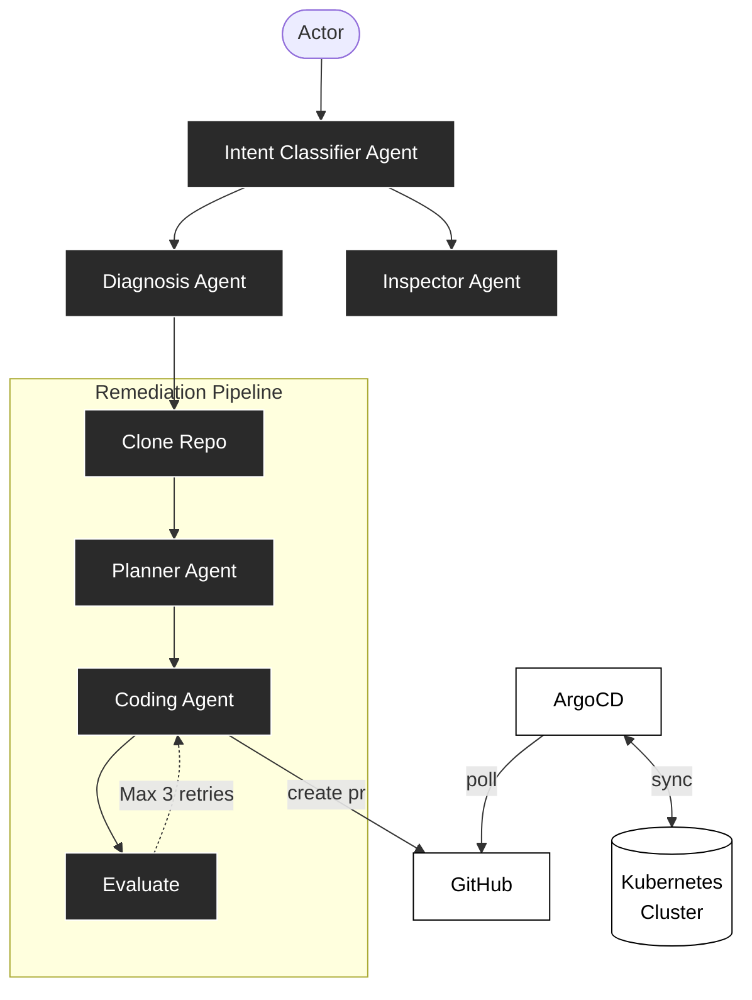

# Kubernaut

**Kubernaut diagnoses issues in a Kubernetes cluster and safely proposes fixes through GitOps — it never applies changes directly to the cluster.**

A multi-agent system that combines live cluster diagnosis (Kubernetes, Prometheus, Loki) with a bounded, human-approved remediation path (GitHub PR → ArgoCD sync).

---

## Architecture



---

## How a request flows through the system

1. **Entry point** — a chat message (`Actor`) or an Alertmanager webhook hits the **Intent Classifier**, which routes to either a fast read-only path or the diagnosis path.
2. **Inspector Agent** — handles simple factual lookups ("what namespace is pod X in") with a single tool call. No investigation, no state created.
3. **Diagnosis Agent** — investigates real problems using read-only tools (Kubernetes API, Prometheus, Loki). Produces a structured `next_action` recommendation, not a natural-language essay.
4. **Remediation Pipeline** — only runs if Diagnosis proposes a fix:
    - **Planner Agent** validates the proposed change against a **service registry** — a static, human-authored file mapping each service to its GitOps file path and the specific fields an agent is allowed to touch. If the proposed field isn't in the registry, the pipeline stops and escalates instead of guessing.
    - **Coding Agent** computes an in-memory, structured patch (exact field replacement, not free-form regeneration) and opens a PR via the GitHub API.
    - **Evaluate** runs lint/dry-run checks before the PR is finalized, with up to 3 retries on failure.
5. **GitOps sync** — ArgoCD polls GitHub, and only applies the change once a human has reviewed and merged the PR. `selfHeal` is enabled, so any out-of-band drift reverts automatically — git is the only path to a durable change.

---

## Key design decisions

These are the calls this project makes on purpose, and the reasoning behind each one:

| Decision                                                         | Why                                                                                                                                                                                                                                                                          |
| ---------------------------------------------------------------- | ---------------------------------------------------------------------------------------------------------------------------------------------------------------------------------------------------------------------------------------------------------------------------- |
| **No direct `kubectl apply` remediation path**                   | Fights ArgoCD's own self-heal, and removes the audit trail / approval gate that's the actual point of the project. Every write goes through a PR.                                                                                                                            |
| **Remediation is scoped to `values.yaml` fields only**           | Editing a typed scalar can't produce invalid YAML or an unreviewable diff. Editing Helm templates or arbitrary code is a structural change with much higher blast radius — intentionally out of scope.                                                                       |
| **A static service registry, not repo search or a vector index** | The set of agent-manageable fields is small and known ahead of time. A registry lookup is deterministic, auditable, and doubles as a whitelist — there's nothing to search because nothing should be discoverable at runtime.                                                |
| **No vector database**                                           | Diagnosis and remediation both operate on live, current state — nothing here benefits from semantic retrieval over a stale corpus. (kagent itself reuses its existing Postgres instance rather than deploying separate vector infrastructure — same reasoning applies here.) |

---

## Agents

| Agent                 | Access                              | Responsibility                                                            |
| --------------------- | ----------------------------------- | ------------------------------------------------------------------------- |
| **Intent Classifier** | none                                | Routes a request to Inspector, Diagnosis, or (if alert-originated) Triage |
| **Inspector**         | read-only                           | Single-tool-call factual lookups                                          |
| **Diagnosis**         | read-only (K8s, Prometheus, Loki)   | Root-cause investigation, produces `next_action`                          |
| **Planner**           | read-only (registry, repo contents) | Validates `next_action` against the registry, builds a structured plan    |
| **Coding Agent**      | write (scoped to registry fields)   | Computes the patch, opens the PR                                          |
| **(escalation path)** | issue creation only                 | Files a GitHub issue when a fix falls outside the registry                |

---

## Tech stack

- **Cluster**: Kubernetes (kind for local dev)
- **GitOps**: ArgoCD (`selfHeal: true`, `prune: true`), Helm
- **Agent runtime**: Python/Go, MCP for tool integration, any LLM API
- **Observability**: Prometheus, Loki, OpenTelemetry
- **Git integration**: GitHub REST API (Contents, Refs, Pulls) — no local clone
- **State**: a lightweight `Incident` CRD tracking phase (`Diagnosing → Planning → AwaitingPR → Resolved`), reconciled by a small controller

---

## Repo structure

```
Kubernaut/
├── agent-engine/          # Intent Classifier, Inspector, Diagnosis, Planner, Coding Agent
├── incident-controller/   # Small Go controller reconciling the Incident CRD
├── mcp-tool-servers/      # Kubernetes, Prometheus, Loki MCP servers
├── agent-platform-chart/  # Helm chart: one-time cluster install (CRD, controller, RBAC)
├── agent-gitops-repo/     # Watched by ArgoCD; values.yaml + service-registry.yaml
└── demo/                  # Seed scripts to simulate incidents end-to-end
```

---

## Demo scenarios

1. **Traffic spike → scale replicas** — clean end-to-end declarative path, PR, ArgoCD sync.
2. **Bad deploy → rollback image tag** — Diagnosis correlates a metric spike with a recent commit.
3. **OOMKilled → bump memory limit** — exercises a different registry field.
4. **Downstream dependency failure → diagnosis-only** — demonstrates the agent correctly declining to remediate and explaining why.
5. **Out-of-registry problem → GitHub issue filed** — demonstrates the escalation path instead of a forced/unsafe fix.

Run `demo/simulate.sh <scenario>` to trigger any of the above without needing a live incident.

---

## Getting started

```bash
# 1. Spin up a local cluster
kind create cluster --name Kubernaut

# 2. Install ArgoCD and the agent platform
helm install argocd argo/argo-cd -n argocd --create-namespace
helm install Kubernaut-platform ./agent-platform-chart -n Kubernaut --create-namespace

# 3. Point ArgoCD at the GitOps repo
kubectl apply -f agent-gitops-repo/application.yaml

# 4. Run a simulated incident
./demo/simulate.sh traffic-spike
```
