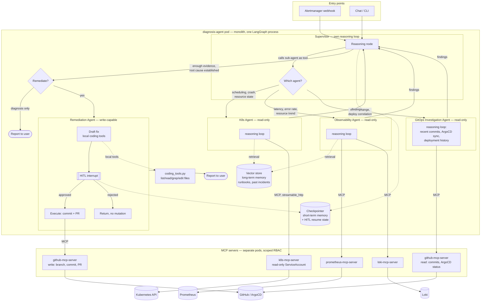

# Kubernaut

An autonomous (human-gated) SRE agent for Kubernetes that answers questions, diagnoses incidents from chat or Prometheus alerts, plans remediations, and ships GitOps fixes as GitHub PRs.

---

## 1. Scope

- Chat-based Q&A over live cluster state ("what namespace is pod X in?").
- Diagnose using cluster state (pods, events, describe), logs (Loki) and prometheus alerts
- Produce a remediation plan and, when the fix is a config/manifest change, open - a GitHub PR via a coding agent.
  Be safe by default: read-then-act, human approval before any mutation, full audit trail.

## 2. MVP Architecture Diagram

---

## 3. Tech Stack Summary

| Layer             | Choice                                                                           |
| ----------------- | -------------------------------------------------------------------------------- |
| Orchestration     | **LangGraph** (supervisor + subgraphs, Postgres checkpointer, HITL interrupts)   |
| Serving           | FastAPI / LangServe                                                              |
| Tools             | **MCP servers**: Kubernetes, Prometheus, Loki, GitHub (`langchain-mcp-adapters`) |
| RAG               | pgvector or Qdrant + embedding/ingestion pipeline                                |
| State/Memory      | Postgres (checkpointer + audit)                                                  |
| Observability     | LangSmith + OpenTelemetry                                                        |
| Policy/Validation | OPA/Conftest, kubeconform, helm, kustomize                                       |
| Delivery          | GitHub PRs → Argo CD (GitOps)                                                    |
| Packaging         | Helm umbrella chart; coding agent as per-run K8s `Job`                           |
| Secrets           | External Secrets Operator / Vault                                                |
