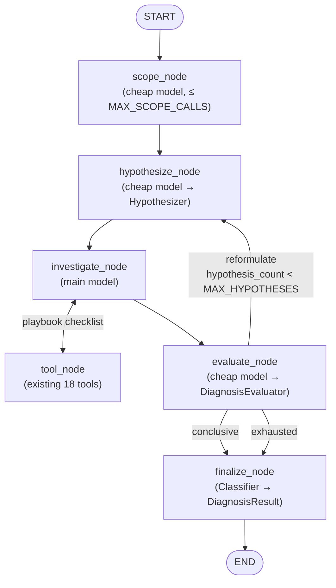

# DiagnosisAgent SRE-Style Restructure — Design

Date: 2026-07-24

## Motivation

Today `DiagnosisAgent` (`agents/diagnosis_agent.py`) is a flat ReAct loop:
`reasoning_node ⇄ tool_node` up to a single `MAX_ITERATIONS = 30`, then `finalize_node`
runs the `Classifier` to produce a `DiagnosisResult`. All investigation strategy lives in one
large monolithic `SYSTEM_PROMPT`. This does not converge reliably on Kubernetes incidents that
need *correlated, structured* debugging — the model wanders across 18 tools with no enforced
method, sometimes burning the full iteration budget without a confident root cause.

The goal is to make the agent reason like an SRE: **scope → hypothesize → gather evidence →
evaluate**, driven by per-failure-class **playbooks**, with hard efficiency controls so a wrong
hypothesis can't blow up token/iteration cost (the user's stated concern #1 and #3).

## Scope

In scope:
- Replace the flat loop with an explicit four-phase LangGraph (`scope → hypothesize →
  investigate ⇄ tool → evaluate → {reformulate | finalize}`).
- A markdown-based **playbook library** (`playbooks/*.md`, YAML frontmatter + checklist), one
  playbook per failure class the existing integration tests cover, plus a `generic` fallback.
- Playbook selection by the cheap `classifier_llm` from scope signals + playbook triggers.
- Per-phase iteration budgets + a `max_hypotheses = 3` reformulation cap, replacing the single
  `MAX_ITERATIONS`.
- Model tiering: cheap model for scope/hypothesize/evaluate, main model for investigate only.
- New state fields + two new structured-output helper classes (`Hypothesizer`, `DiagnosisEvaluator`)
  and two new pydantic models; `DiagnosisResult` itself is **unchanged**.

Out of scope (explicitly deferred):
- No new MCP tools (v1 uses the existing 18 tools — `k8s` 12, `prometheus` 4, `loki` 2). The
  playbook checklists are written against tools that exist today; granular tools like
  `get_recent_changes`/`error_rate_by_pod` are a fast-follow.
- No change to `DiagnosisResult`'s shape, so `PlannerAgent`/orchestrator/`graph/nodes.py`
  downstream are untouched.
- No richer per-phase progress streaming to the UI — the existing node-level
  `started`/`completed` events in `graph/nodes.py::make_diagnose_node` stay as-is (per-phase SSE
  is a possible later enhancement).
- No change to `PlannerAgent`/`RemediationAgent`.

## Architecture

### Phase graph



### Phase-to-intent mapping (the user's steps 1–4)

| PLAN.md step | Node | Model | Budget | Output into state |
|---|---|---|---|---|
| 1. Scoping | `scope_node` | cheap | ≤ `MAX_SCOPE_CALLS` (3) tool calls | `scope_summary` |
| 2. Classifying | `hypothesize_node` | cheap | 1 LLM call | `current_hypothesis`, `selected_playbook_id` |
| 3. Gather evidence | `investigate_node ⇄ tool_node` | **main** | ≤ `MAX_INVESTIGATE_ITERATIONS` (8) per hypothesis | investigation messages |
| 4. Three outcomes | `evaluate_node` | cheap | 1 LLM call | verdict → route |
| — finalize | `finalize_node` | cheap (`Classifier`) | 1 LLM call | `diagnosis_result` |

### Phase specifications

**`scope_node`** — LLM-driven but tightly capped. Runs a mini ReAct pass (cheap model) limited
to `MAX_SCOPE_CALLS` discovery calls, choosing *which* discovery tools to run from the query
(a service query → list services/pods/events; a scheduling query → list pods/nodes). Broad but
shallow: it establishes the scene (namespace, workloads, pod phases, notable events, high-level
health) without deep-diving, so it can't lock onto a wrong deep signal. Emits a compact,
structured **scope summary** (plain text or a small structured blob) stored in `scope_summary`,
reused unchanged by every later phase — scoping runs exactly once per diagnosis.

**`hypothesize_node`** — the cheap `classifier_llm`, via a new `Hypothesizer` helper
(structured output `HypothesisSelection`). Input: the `scope_summary`, the original query, the
list of `ruled_out` hypotheses so far, and the catalog of playbook `{playbook_id,
trigger_conditions}` from `PlaybookLibrary`. Output: a ranked leading `current_hypothesis` (one
sentence) and a `selected_playbook_id`. If no playbook's triggers match, it selects
`generic` — so there is always a playbook (solves concern #2, the fallback). Increments
`hypothesis_count` and resets the per-investigation iteration counter.

**`investigate_node ⇄ tool_node`** — the strong `diagnosis_llm`. This is the only deep-reasoning
phase. The node's prompt is lean: the selected playbook's checklist + conclusion criteria +
`should_not_conclude` discriminators are injected, plus the `scope_summary` and any
`ruled_out` context. The existing `tool_node` (with `duplicate_call_filter` and
`HistoryCompactor`) is reused verbatim. Bounded by `MAX_INVESTIGATE_ITERATIONS` per hypothesis.

**`evaluate_node`** — the cheap model, via a new `DiagnosisEvaluator` helper (structured output
`EvaluationVerdict`). Judges the evidence gathered for the current hypothesis and returns one of
three verdicts, implementing the user's step 4:

- `conclusive` — evidence supports a root cause. Carries a `requires_remediation` hint
  (k8s-config-fixable = true; application-level bug not fixable via k8s manifests = false) that
  the finalize `Classifier` will honor. → `finalize_node`.
- `reformulate` — evidence ruled the current hypothesis out but suggests a different one, and
  `hypothesis_count < MAX_HYPOTHESES`. Records `{hypothesis, why_ruled_out}` into `ruled_out`
  and loops back to `hypothesize_node` (which sees the ruled-out list and won't re-pick it).
- `exhausted` — no new hypothesis, or `hypothesis_count >= MAX_HYPOTHESES`. → `finalize_node`
  with a signal to produce `diagnosis_success = false` (escalate; never fail-open).

**`finalize_node`** — reuses the existing `Classifier`, unchanged in contract: produces the
`DiagnosisResult`. When `evaluate_node` returned `exhausted`, finalize forces
`diagnosis_success = false` (mirroring today's `MAX_ITERATIONS` fail-safe at
`diagnosis_agent.py:316-331`). The full phase message trail is available to the classifier.

### Routing functions

- `scope → hypothesize`: unconditional.
- `hypothesize → investigate`: unconditional.
- `investigate` conditional: if last message has tool calls **and** per-investigation counter
  `< MAX_INVESTIGATE_ITERATIONS` → `tool_node`; else → `evaluate_node`.
- `tool_node → investigate`: unconditional (existing pattern).
- `evaluate` conditional (`_evaluate_routing`): `conclusive`/`exhausted` → `finalize_node`;
  `reformulate` → `hypothesize_node`.

## State & data model changes

`DiagnosisAgentState` (in `graph/state.py`) gains:

```python
class DiagnosisAgentState(MessagesState):
    query: str
    diagnosis_result: DiagnosisResult
    # phase machinery (new)
    scope_summary: str
    current_hypothesis: str
    selected_playbook_id: str
    ruled_out: list[dict]          # [{"hypothesis": str, "why_ruled_out": str}, ...]
    hypothesis_count: int
    investigate_iterations: int    # reset to 0 each time hypothesize_node runs
    # iteration_count is removed (superseded by the per-phase counters above)
```

Two new pydantic models (structured outputs for the new helpers), plus `DiagnosisResult`
unchanged:

```python
# models/hypothesis.py
class HypothesisSelection(BaseModel):
    hypothesis: str                # one-sentence leading hypothesis
    playbook_id: str               # a real playbook_id, or "generic"
    reasoning: str

# models/evaluation.py
class EvaluationVerdict(BaseModel):
    verdict: Literal["conclusive", "reformulate", "exhausted"]
    reasoning: str
    requires_remediation: bool | None = None   # set when verdict == "conclusive"
    next_hypothesis: str | None = None         # set when verdict == "reformulate"
    why_ruled_out: str | None = None           # set when verdict == "reformulate"
```

`DiagnosisResult` (`models/diagnosis_result.py`) is untouched — the whole downstream
(`Classifier`, `graph/nodes.py::require_remediation_routing_node`, `PlannerAgent`) keeps working
with no changes.

## Playbook library

### Format (matches PLAN.md's example)

Markdown files in `playbooks/`, one per failure class, with YAML frontmatter:

```markdown
---
playbook_id: network
category: network
trigger_conditions:
  - "5xx or connection-refused/timeout errors present"
  - "no matching application-level error logs in the same window"
---

# Network / Connectivity Failure

## Checklist
1. tool: check_service_connectivity   params: {service, namespace}   conclusive: false
2. tool: error_rate                    params: {app, window}          conclusive: false
3. tool: get_events                    params: {namespace}            conclusive: true
   conclusion_criteria: >
     endpoints empty or all-not-ready AND no matching app-level error logs
     AND a Service/NetworkPolicy change is visible in events within the window

## Conclusion
root_cause = network iff endpoints unhealthy/empty while errors are near-uniform
across pods (not isolated to one) and a correlated recent change is present.

## Do not conclude
- A single crashing pod (that's an application/workload failure, use the crashloop playbook)
```

The checklist tools are **only** tools that exist today. Where PLAN.md's example named
non-existent tools, they map to real ones: `get_endpoints`/`get_readiness_status` →
`check_service_connectivity`; `error_rate_by_pod` → `error_rate` (+ per-pod reasoning from
`describe_resource`/`get_events`); `get_recent_changes` → `get_events` (change signal).

### `PlaybookLibrary` helper (`agents/helpers/playbook_library.py`)

Loads and parses all `playbooks/*.md` once at construction. Exposes:
- `list_triggers() -> list[dict]` — `[{playbook_id, category, trigger_conditions}]` for the
  `Hypothesizer` prompt (compact — triggers only, not full checklists).
- `get(playbook_id) -> Playbook` — full parsed playbook (checklist text, conclusion criteria,
  do-not-conclude) injected into `investigate_node`; falls back to the `generic` playbook if the
  id is unknown.

### v1 playbook catalog (full coverage)

Each playbook's checklist + discriminators are derived from the matching
`test/integration_test/cases/*/expected_answer.json` (`key_evidence` → checklist steps,
`should_not_conclude` → "do not conclude" section). The catalog:

| playbook_id | Covers scenarios | Core evidence tools | Key discriminator |
|---|---|---|---|
| `network` | (PLAN.md example; no integration case yet) | `check_service_connectivity`, `error_rate`, `get_events` | uniform-across-pods + recent change vs. single crashing pod |
| `rbac` | rbac-forbidden-in-app | `get_pod_logs`/`get_previous_logs`, `get_events` | Forbidden error text is itself the root cause; don't enumerate roles |
| `autoscaling` | hpa-metrics-unavailable, hpa-capped-at-max-replicas | `get_resource(hpa)`, `get_resource(deployment)` | missing CPU request on target vs. metrics-server down |
| `scheduling` | pending-insufficient-resources, pending-taint-no-toleration, node-disk-memory-pressure | `describe_resource(pod)`, `get_node_conditions`, `get_events` | FailedScheduling reason (taint / resources / pressure) |
| `resource_governance` | resourcequota-exhausted | `get_resource(resourcequota)`, `get_events`, `describe_resource(pod)` | quota-exceeded event vs. node capacity |
| `storage` | pvc-pending-no-storageclass | `get_resource(pvc)`, `get_resource(storageclass)`, `get_events` | no matching StorageClass vs. provisioner failure |
| `secret_configmap` | secret-wrong-key-reference | `describe_resource(pod)`, `get_resource(secret/configmap)`, `get_events` | referenced key/name missing (report as unresolved reference) |
| `rollout` | rollout-complete-but-broken | `rollout_status`, `describe_resource(deployment/pod)`, `get_pod_logs`, `error_rate`/`recent_logs` | completed rollout ≠ healthy app; needs pod/log/metric pivot |
| `generic` | fallback when no trigger matches | — (today's phase-based investigation guidance) | — |

The `generic` playbook's body is the current phase-based investigation guidance from the
existing `SYSTEM_PROMPT`, repurposed as the default checklist — nothing is lost when no specific
playbook matches.

## Efficiency mechanisms (concerns #1 & #3)

1. **Per-phase budgets replace `MAX_ITERATIONS = 30`.** Worst case is bounded and legible:
   `MAX_SCOPE_CALLS (3) + MAX_HYPOTHESES (3) × MAX_INVESTIGATE_ITERATIONS (8)` ≈ 27 tool calls,
   but only reached if every hypothesis is wrong; a matched playbook typically concludes in one
   short investigation.
2. **Model tiering.** scope/hypothesize/evaluate/finalize run on the cheap `classifier_llm`
   (gpt-4.1-nano); only `investigate_node` uses the expensive `diagnosis_llm`. The bulk of LLM
   calls move to the cheap tier.
3. **Ruled-out memory.** `evaluate_node` records why each hypothesis failed; `hypothesize_node`
   receives that list and won't re-select a ruled-out playbook or re-propose a dead hypothesis —
   the core anti-loop guard when guesses keep missing.
4. **Scope-once, reuse.** The `scope_summary` is computed once and threaded into every later
   phase; the agent never re-scopes.
5. **Lean per-phase prompts.** The monolithic `SYSTEM_PROMPT` is decomposed into focused
   per-node prompts; the investigate prompt carries only the *selected* playbook, not all
   investigation guidance for all failure classes — a direct token reduction on the hot path.

## File structure (new / changed)

```
playbooks/
  network.md  rbac.md  autoscaling.md  scheduling.md  resource_governance.md
  storage.md  secret_configmap.md  rollout.md  generic.md
agents/helpers/
  playbook_library.py     (new: PlaybookLibrary + Playbook)
  hypothesizer.py         (new: Hypothesizer → HypothesisSelection)
  evaluator.py            (new: DiagnosisEvaluator → EvaluationVerdict)
  __init__.py             (export the three new helpers)
models/
  hypothesis.py           (new: HypothesisSelection)
  evaluation.py           (new: EvaluationVerdict)
  __init__.py             (export the two new models)
agents/diagnosis_agent.py (rewritten graph: scope/hypothesize/investigate/evaluate/finalize)
graph/state.py            (DiagnosisAgentState phase fields)
graph/builder.py          (pass classifier_llm as the cheap phase model where needed)
```

## Testing / validation plan

- **Unit tests** (no LLM, fully mockable — matches `test/unit_test/` conventions):
  - `PlaybookLibrary`: parses frontmatter + checklist correctly; `list_triggers` returns all
    playbooks; `get` returns the right playbook and falls back to `generic` on unknown id;
    malformed playbook file surfaces a clear error.
  - Routing functions: `_investigate_routing` respects `MAX_INVESTIGATE_ITERATIONS`;
    `_evaluate_routing` maps each verdict to the right next node; reformulate loop stops at
    `MAX_HYPOTHESES`.
  - `Hypothesizer`/`DiagnosisEvaluator`: structured-output parsing + the null-parse fallback
    path (mirroring `Classifier`'s existing fallback at `classifier.py:29-37`).
- **Integration tests** (`pytest -m integration`, real cluster + real LLM — the acceptance bar):
  the existing 10 scenarios across 7 categories must still pass via `ScenarioEvaluator`, and the
  run should show **lower** iteration/token counts and **higher** convergence than the current
  flat-loop baseline. Each playbook is validated against its scenario's `key_evidence` /
  `should_not_conclude`.
- **Baseline capture**: record the current flat-loop's per-scenario iteration counts before the
  rewrite, to prove the efficiency claim after.

## Backward compatibility & rollback

- `DiagnosisResult` unchanged → `graph/nodes.py`, `PlannerAgent`, orchestrator, API, and UI need
  no changes.
- `DiagnosisAgent.invoke`/`ainvoke` signatures unchanged; `graph/nodes.py::make_diagnose_node`
  still calls `ainvoke({"messages": [], "query": ..., ...})` — the node seeds the new phase
  fields with defaults (empty `scope_summary`, `hypothesis_count=0`, etc.).
- The entire change is contained in the diagnosis agent + its helpers + the new `playbooks/`
  dir; reverting the rewrite restores the flat loop without touching any other agent.

## Open questions

None outstanding — graph shape, tool scope (existing-only), playbook storage/format/selection,
v1 coverage (full), `max_hypotheses = 3`, and LLM-driven capped scoping were all resolved during
brainstorming.
